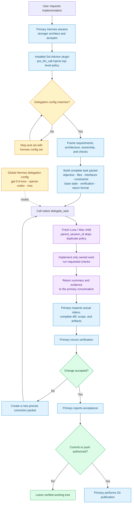

# Sol Advisor orchestration flow

## Responsibilities

| Primary Hermes session | Luna / Max child |
|---|---|
| Resolves intent and architecture | Receives a complete, fresh-context task packet |
| Defines exact ownership and verification | Modifies only its owned files |
| Inspects the real working tree and complete diff | Runs the packet's requested checks |
| Reruns checks and decides acceptance | Returns evidence as a claim for primary review |
| Owns corrections, commits, pushes, and final reporting | Does not publish unless explicitly authorized |

## Important boundaries

- `delegate_task` does not select a model per call; the three global `delegation.*` settings route the child.
- The plugin's `pre_llm_call` policy is top-level only; a non-empty `parent_session_id` skips it for delegated children.
- The plugin's `pre_tool_call` gate blocks only `delegate_task`; other tools pass through unchanged.
- A completed leaf child is not resumed. Corrections use a new, precise delegation packet.
- Delegation is asynchronous but process-local, not a durable background job.
- Independent, non-overlapping work may be batched; shared-file and dependent work stays serial.
